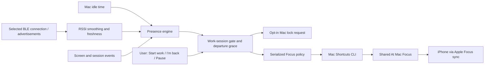

# Presence Bridge

[](https://github.com/LeoHChen/presence-bridge/actions/workflows/ci.yml)

A native macOS menu bar app that locks your Mac when your selected Apple Watch or iPhone moves away, using ordinary Bluetooth signal strength. Optional Apple Shortcuts integration manages a shared **At Mac** Focus.

**v0.1.0 preview:** the owner reported successful Apple Watch walk-away locking on one Apple Silicon Mac running macOS 27. Device compatibility and radio reliability vary; calibrate and test your own setup. macOS 13+ build target, Swift/SwiftUI, no third-party dependencies, MIT licensed. Each launch starts in observation mode with Bluetooth and automatic actions off.

## Download and install

**[Download Presence Bridge 0.1.0 for Mac](https://github.com/LeoHChen/presence-bridge/releases/download/v0.1.0/PresenceBridge-0.1.0-macos-universal.zip)** · **[Release notes and checksums](https://github.com/LeoHChen/presence-bridge/releases/tag/v0.1.0)**

The universal ZIP includes Apple Silicon and Intel code, the app, installation instructions, MIT license, and build information. No Xcode or Swift installation is needed to use the download. Intel hardware and older macOS versions have not been field-tested.

1. Expand the ZIP and drag **Presence Bridge.app** to **Applications** before granting permissions.
2. Open that copy. **This preview is ad-hoc signed and not notarized.** If macOS blocks it and you choose to trust this release, follow Apple's per-app [Open Anyway instructions](https://support.apple.com/en-us/102445). Keep Gatekeeper and SIP enabled.
3. Follow the walk-away setup below. If an enabled permission entry still fails, use the [permission recovery steps](docs/proximity-setup.md#permission-appears-enabled-but-locking-fails).

**[Complete installation, verification, and removal guide](docs/install.md).** This is convenience automation; keep macOS's own lock and password settings configured.

## What works, and what does not

| Capability | This MVP |
|---|---|
| Detect Mac activity | Reads seconds since input; no keystroke content |
| Estimate departure | Calibrated Bluetooth with an 8-second grace period; idle-only mode uses 15 seconds |
| Optional Bluetooth signal | Active Core Bluetooth connection to a selected device, connected RSSI polling, passive fallback, reconnection, and calibration |
| Apple Watch proximity | Active connection, screen-dark departure, and return tested on one Watch/Mac setup; Apple's Auto Unlock authentication signal remains unavailable |
| Ordinary iPhone as a beacon | **Try active connection first:** support depends on the device/OS; passive advertisements alone may stop or rotate |
| Automatically lock the Mac | Owner-reported successful walk-away test; Lock now also verified. Requires control permission, calibration, and explicit arming |
| Automatically change iPhone Focus | User-created Mac shortcuts change a **shared** Focus; end-to-end testing remains pending |
| Silence only the iPhone, keep all Mac notifications | **Not implemented:** shared Focus also affects the Mac; disabling Focus sharing prevents this bridge reaching the iPhone |
| Return after locking/sleep | Unlock normally, then click **I’m back**; unattended return detection is deferred |
| Apple Watch Auto Unlock | Continues to be an independent Apple feature; this app never unlocks the Mac |

The original goal is fewer duplicate phone notifications while working on a Mac. The shared-Focus path is a practical starting point, **not a complete solution to phone-only notification suppression**. Focus is a coarse notification policy; this project cannot detect that the Mac already delivered an individual notification.

## Set up walk-away locking

Turn on **Use iPhone / Watch proximity**, select your own device, and leave **Maintain an active Bluetooth connection** enabled. The app connects only to that selection and reads RSSI every two seconds. It retries failed connections and uses advertisements when a connection is unavailable. It does not read private Bluetooth databases or Apple's Auto Unlock state.

1. Sit normally at the desk, wait for **near**, and click **Calibrate at desk**. Wait for at least three fresh samples.
2. Click **Test walking away**. Let your Watch screen go dark and walk into another room for 30–40 seconds without touching the Mac, then return. Confirm departure was detected and the device is near again. This test sends no lock or Focus actions.
3. Enable **Lock automatically when away**, grant Accessibility to the exact app, and test **Lock now** after saving work. On the tested macOS 27 system, the permission is under **Privacy & Security → Device Control and Data Access**. Verify that the Mac actually locks.
4. Unlock normally, wait for **near**, then click **I’m back** / **Start work** and repeat the walk. The app refuses to arm device locking without a fresh near signal.
5. After locking, screen sleep, or session switching, unlock if necessary and click **I’m back** to rearm. **Pause** stops automatic effects. Calibration and effect toggles reset each launch, including launches at login.

Signal strength is not distance. A typical complete signal loss reaches an away decision about 16–17 seconds after the last valid reading; weak-signal departure also depends on smoothing and the chosen threshold. New input cancels departure. If the Mac's radio becomes unavailable after a near device was established, prolonged radio loss is treated as departure too. A phone left on the desk still cannot defeat the idle timeout.

**[Detailed walk-away setup and diagnostics](docs/proximity-setup.md).** Compatibility is experimental until your device passes the walk test. The public-API active-connection approach is also used by [BLEUnlock](https://github.com/ts1/BLEUnlock); this project's adapter is independently implemented and never unlocks the Mac.

For idle-only locking, leave Bluetooth off: the default is five minutes without input plus 15 seconds of grace. For optional Focus, create **At Mac** and the three recipes in the [Shortcuts setup guide](docs/shortcuts.md), enable **Share Across Devices** on Mac and iPhone, and test both devices before enabling the Focus toggle. Watch locking does not require Shortcuts.

## Architecture



- [`Sources/PresenceCore`](Sources/PresenceCore): deterministic presence, proximity, and Focus policies, with tests.
- [`Sources/PresenceBridge`](Sources/PresenceBridge): SwiftUI menu bar, public Mac sensors, lock requests, Shortcuts execution, and login item support.
- [`docs/architecture.md`](docs/architecture.md): state transitions, failure handling, boundaries.
- [`docs/platform-limitations.md`](docs/platform-limitations.md): Apple documentation and what it means for this design.
- [`docs/shortcuts.md`](docs/shortcuts.md): guarded On/Renew/Off recipes with a 15-minute expiry.
- [`docs/roadmap.md`](docs/roadmap.md): staged milestones and acceptance criteria.
- [`SECURITY.md`](SECURITY.md): permissions, privacy, and failure modes.

## Development

Requires Swift 6.0+ through Xcode 16+ or compatible Command Line Tools. Platform minimums are compile targets, not a completed hardware support matrix; see [validation](docs/validation.md).

```sh
git clone https://github.com/LeoHChen/presence-bridge.git
cd presence-bridge
swift build
bash scripts/test.sh
swift run PresenceBridge --self-check
bash scripts/build-app.sh
open "dist/Presence Bridge.app"
```

Open `Package.swift` in Xcode for source navigation and debugging. Run the packaged `.app` for a stable bundle identity and privacy prompts. CI tests the policies, builds the bundle, and runs an effect-free executable check. No lock, Bluetooth, or Focus automation is exercised in CI.

To build the universal download from a clean, committed checkout, run `bash scripts/package-release.sh`. ZIP, build information, installation guide, and SHA-256 checksums appear in `dist/releases/`. Packaging uses a separate staging directory so it does not replace a running development app. See the [release procedure](docs/releasing.md) and [changelog](CHANGELOG.md).

For a user-session LaunchAgent alternative, see [launch at login](docs/launch-at-login.md). Use only one login mechanism. No root daemon or privileged helper is needed.

Contributions are welcome; start with [CONTRIBUTING.md](CONTRIBUTING.md) and the [issues](https://github.com/LeoHChen/presence-bridge/issues). See [LICENSE](LICENSE).
