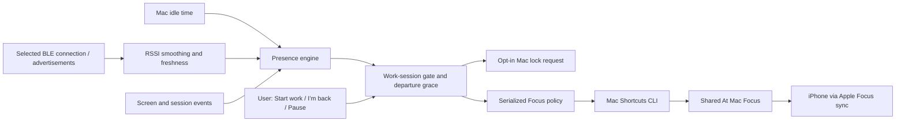

# Presence Bridge

[](https://github.com/LeoHChen/presence-bridge/actions/workflows/ci.yml)

A local-first macOS menu bar app that estimates when you leave your desk, requests a Mac lock, and runs Apple Shortcuts to manage an **At Mac** Focus.

**Status: developer MVP, not a security product.** Native Swift/SwiftUI, macOS 13+, no dependencies, MIT licensed. The app starts in observation mode. Automatic actions and Bluetooth scanning require explicit opt-in on each launch.

## What works, and what does not

| Capability | This MVP |
|---|---|
| Detect Mac activity | Reads seconds since input; no keystroke content |
| Estimate departure | Idle timeout plus a 15-second grace period |
| Optional Bluetooth signal | Active Core Bluetooth connection to a selected device, connected RSSI polling, passive fallback, reconnection, and calibration |
| Apple Watch proximity | **Experimental:** ordinary BLE advertisements/connection may work; Apple's Auto Unlock authentication signal remains unavailable |
| Ordinary iPhone as a beacon | **Try active connection first:** support depends on the device/OS; passive advertisements alone may stop or rotate |
| Automatically lock the Mac | Opt-in Control-Command-Q request through public event APIs; requires Accessibility and device testing |
| Automatically change iPhone Focus | User-created Mac shortcuts change a **shared** Focus, which Apple syncs to the iPhone |
| Silence only the iPhone, keep all Mac notifications | **Not implemented:** shared Focus also affects the Mac; disabling Focus sharing prevents this bridge reaching the iPhone |
| Return after locking/sleep | Unlock normally, then click **I’m back**; unattended return detection is deferred |
| Apple Watch Auto Unlock | Continues to be an independent Apple feature; this app never unlocks the Mac |

The original goal is fewer duplicate phone notifications while working on a Mac. The shared-Focus path is a practical starting point, **not a complete solution to phone-only notification suppression**. Focus is a coarse notification policy; this project cannot detect that the Mac already delivered an individual notification.

## Quick start

Requires a Mac with Swift 6.0+ (Xcode 16+ or compatible Command Line Tools) and the built-in Shortcuts app. An iPhone on the same Apple Account is needed only for shared Focus. Platform minimums are compile targets, not a completed hardware support matrix; see [validation](docs/validation.md).

```sh
git clone https://github.com/LeoHChen/presence-bridge.git
cd presence-bridge
bash scripts/test.sh
bash scripts/build-app.sh
open "dist/Presence Bridge.app"
```

1. Open the person icon in the menu bar. Observe the state and idle counter first.
2. For Focus, create **At Mac** and the three shortcuts in the [Shortcuts setup guide](docs/shortcuts.md). Enable **Share Across Devices** on the Mac and iPhone. Test the notification effect on both devices.
3. For locking, enable **Lock automatically when away**, grant Accessibility to **Presence Bridge**, and test **Lock now** after saving your work. Visually verify that the Mac requires authentication.
4. Choose the desired effects, then **Start work**. Default departure is 5 minutes without input plus 15 seconds of grace in idle-only mode. Bluetooth mode uses a 5-second input veto, 8-second departure grace, and 8-second signal expiry. See the walk-away setup below.
5. After departure, locking, screen sleep, or session switching, unlock if necessary and click **I’m back**. **Pause** stops automatic effects and attempts to release the Focus lease.

Use a stable copy in `/Applications/Presence Bridge.app` before granting permissions or enabling **Launch at login**. Local builds are ad-hoc signed, not notarized. Do not disable Gatekeeper or SIP. Each launch starts in observation mode, including login launches.

## Bluetooth is optional

Turn on **Use iPhone / Watch proximity**, select your own device, and leave **Maintain an active Bluetooth connection** enabled. The app connects only to that selection and reads RSSI every two seconds. It retries failed connections and uses advertisements when a connection is unavailable. It does not read private Bluetooth databases or Apple's Auto Unlock state.

Keep the selected device at the desk and click **Calibrate at desk**, then wait for fresh near samples. Use **Test walking away** before enabling locks. This test runs the actual departure policy with lock and Focus effects disabled. After a successful test, enable automatic locking and click **Start work**. The app refuses to arm a Bluetooth lock session until the device has been observed near.

Signal strength is not distance. A typical complete signal loss reaches an away decision about 16–17 seconds after the last valid reading; weak-signal departure also depends on smoothing and the chosen threshold. New input cancels departure. If the Mac's radio becomes unavailable after a near device was established, prolonged radio loss is treated as departure too. A phone left on the desk still cannot defeat the idle timeout.

**[Detailed walk-away setup and diagnostics](docs/proximity-setup.md).** Compatibility is experimental until your device passes the walk test. The public-API active-connection approach is also used by [BLEUnlock](https://github.com/ts1/BLEUnlock); this project's adapter is independently implemented and never unlocks the Mac.

## Architecture



- [`Sources/PresenceCore`](Sources/PresenceCore): deterministic presence, proximity, and Focus policies, with tests.
- [`Sources/PresenceBridge`](Sources/PresenceBridge): SwiftUI menu bar, public Mac sensors, lock requests, Shortcuts execution, and login item support.
- [`docs/architecture.md`](docs/architecture.md): state transitions, failure handling, boundaries.
- [`docs/platform-limitations.md`](docs/platform-limitations.md): Apple documentation and what it means for this design.
- [`docs/shortcuts.md`](docs/shortcuts.md): guarded On/Renew/Off recipes with a 15-minute expiry.
- [`docs/roadmap.md`](docs/roadmap.md): staged milestones and acceptance criteria.
- [`SECURITY.md`](SECURITY.md): permissions, privacy, and failure modes.

## Development

```sh
swift build
bash scripts/test.sh
swift run PresenceBridge --self-check
bash scripts/build-app.sh
```

Open `Package.swift` in Xcode for source navigation and debugging. Run the packaged `.app` for a stable bundle identity and privacy prompts. CI tests the policies, builds the bundle, and runs an effect-free executable check. No lock, Bluetooth, or Focus automation is exercised in CI.

For a user-session LaunchAgent alternative, see [launch at login](docs/launch-at-login.md). Use only one login mechanism. No root daemon or privileged helper is needed.

Contributions are welcome; start with [CONTRIBUTING.md](CONTRIBUTING.md) and the [issues](https://github.com/LeoHChen/presence-bridge/issues). See [LICENSE](LICENSE).
